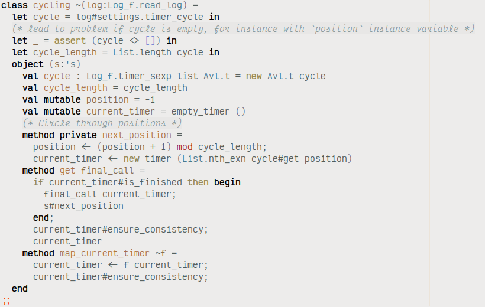
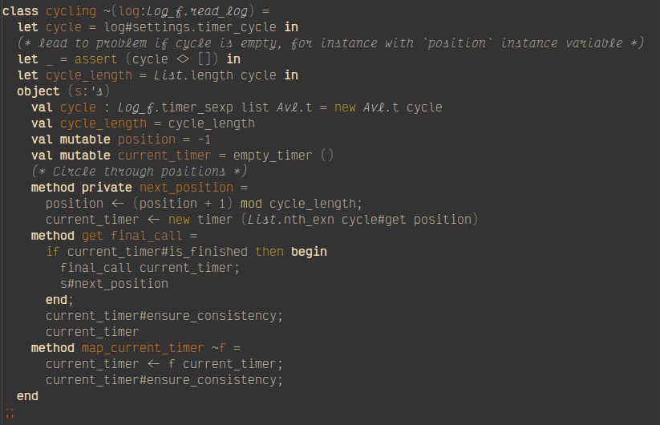

# aero-theme - A practical light theme

_Author:_ Jade Michael Thornton 
_Version:_ 1.1.0 

The Aero themes are a pair of light and dark themes which balance elegance
with practicality. They were originally part of [Aero
Emacs](https://gitlab.com/thornjad/aero) but were distilled for wider use.
The light theme draws color from the vibrancy of northern Minnesota in
Autumn, while the dark theme draws inspiration from my own [ClearNight
Retro](https://github.com/ClearNight/clearnight-retro-syntax) for
[Atom](https://atom.io).

## Preview

## Installation

The Aero themes are not available on MELPA at this time, since they're still
undergoing some tweaking, and I'm not sure MELPA really needs more themes
right now.

The easiest method of installation, if you have it set up already, is with
`straight.el` and `use-package`:

        (use-package aero-theme
          :straight (:host gitlab :repo "thornjad/aero-theme" :branch "main"))

Alternatively, this repository may be cloned into your Emacs's
`custom-theme-directory`.

Either way, activate the theme with

        (load-theme 'aero)
        ;; or, for the dark variant:
        (load-theme 'aero-dark)

---
Converted from `aero-theme.el` by [_el2md_](https://gitlab.com/thornjad/el2md).
